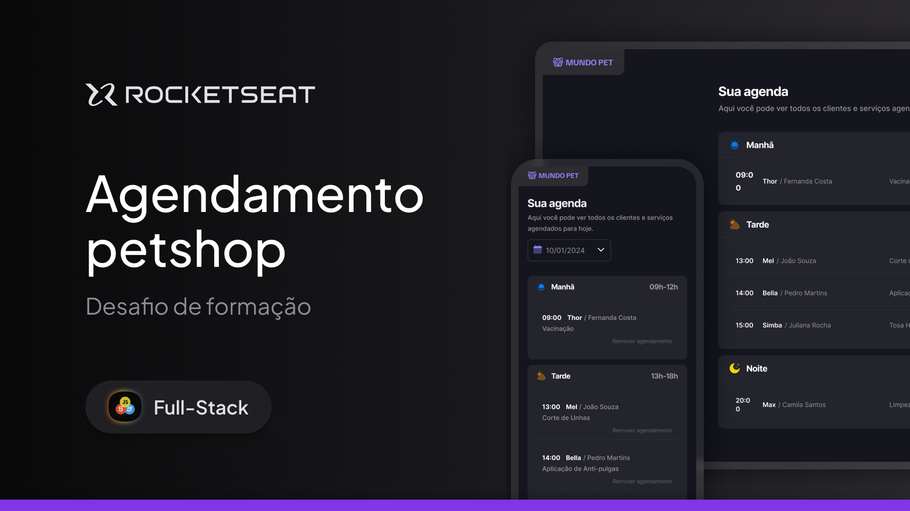

<h1 align="center"> Desafio Agenda Petshop </h1>

O Primeiro desafio da parte Javascript da trilha Full-Stack, promovido pela Rocketseat para ensino de tecnologias WEB.   

  <a href="#tecnologias">Tecnologias</a>&nbsp;&nbsp;&nbsp;|&nbsp;&nbsp;&nbsp;
  <a href="#projeto">Projeto</a>&nbsp;&nbsp;&nbsp;|&nbsp;&nbsp;&nbsp;
  <a href="#layout">Layout</a>&nbsp;&nbsp;&nbsp;|&nbsp;&nbsp;&nbsp;
  <a href="#futuramente">Futuramente</a>&nbsp;&nbsp;&nbsp;|&nbsp;&nbsp;&nbsp;
  <a href="#licença">Licença</a>

  

 

  

## Tecnologias

- **HTML5** para estruturação do conteúdo
- **CSS3** para estilização e responsividade.
- **JavaScript** para adicionar e remover items.
- **Google Fonts** para personalização da tipografia

## Projeto

- [EM BREVE!](...)

## Layout

Tu podes visualizar o layout do projeto através [DESTE LINK](www.figma.com/design/PGswj6u496jXAzfgOyqXjb/Agendamento-de-petshop--Community-?t=KI8giGC0ohEB09OM-0). É necessário ter conta no [Figma](https://figma.com) para acedê-lo.

## Futuramente
- Melhorar o input de hora para um select no futuro (TORNA A WEB APP MAIS USER FRIENDLY)
- Efeito de luz no button de adicionar.

## Licença

Esse projeto está sob a licença MIT.

---

